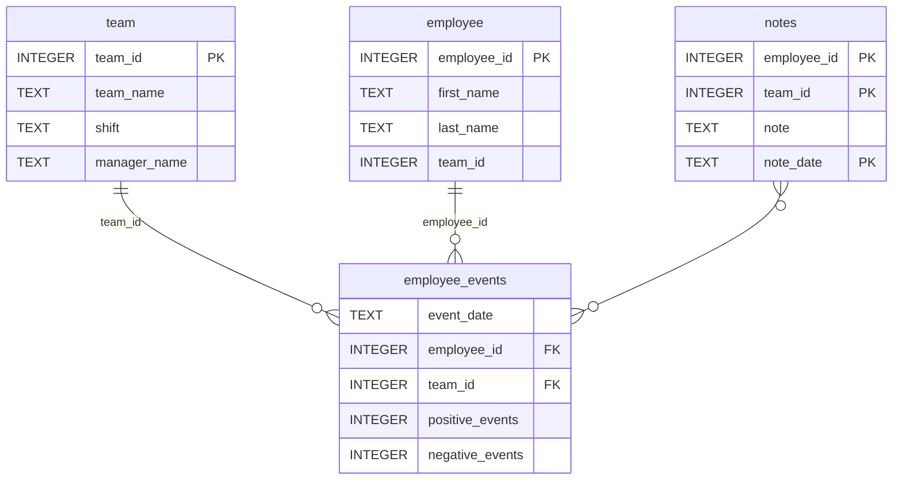

# Software Engineering for Data Scientists 

This repository contains starter code for the **Software Engineering for Data Scientists** final project. Please reference your course materials for documentation on this repository's structure and important files. Happy coding!

### Repository Structure
```
├── README.md
├── assets
│   ├── model.pkl
│   └── report.css
├── env
├── python-package
│   ├── employee_events
│   │   ├── __init__.py
│   │   ├── employee.py
│   │   ├── employee_events.db
│   │   ├── query_base.py
│   │   ├── sql_execution.py
│   │   └── team.py
│   ├── requirements.txt
│   ├── setup.py
├── report
│   ├── base_components
│   │   ├── __init__.py
│   │   ├── base_component.py
│   │   ├── data_table.py
│   │   ├── dropdown.py
│   │   ├── matplotlib_viz.py
│   │   └── radio.py
│   ├── combined_components
│   │   ├── __init__.py
│   │   ├── combined_component.py
│   │   └── form_group.py
│   ├── dashboard.py
│   └── utils.py
├── requirements.txt
├── start
├── tests
    └── test_employee_events.py
```

### employee_events.db



# Employee Events Dashboard

## Overview
This project provides an interactive dashboard for monitoring **employee and team performance** using historical event data. It includes:

- **Employee and Team Views:** View individual or team-level performance metrics.
- **Data Visualizations:** Line charts for cumulative events and bar charts for predicted recruitment risk.
- **Notes Table:** View notes associated with employees or teams.
- **Dynamic Dashboard Filters:** Filter data based on Employee or Team selection.
- **Machine Learning Integration:** Predict recruitment risk using a pre-trained model.

The dashboard is built with **FastHTML**, **Matplotlib**, and **SQLite** for data storage.


---

## Requirements

- Python 3.10+
- FastHTML
- Matplotlib
- SQLite3
- pytest

Install dependencies:

```bash
pip install -r requirements.txt
```
---
## Running the Dashboard
1. Navigate to the project root.

2. Run the FastHTML server:
```bash
python main.py
```
3. Open your browser at http://127.0.0.1:5000
 (default port).

### Routes

- / - Root route showing the index with default QueryBase view.

- /employee/{employee_id} - Employee-specific dashboard.

- /team/{team_id} - Team-specific dashboard.

- /update_dropdown - HTMX route to dynamically update dropdowns based on selection.

- /update_data - POST endpoint to update the report based on dashboard filters.

  ---
 ## Testing

- Run all tests using pytest:
```bash
pytest -v
```

### Tests include:

- Database existence: Checks if employee_events.db exists.

- Table checks: Ensures tables employee, team, and employee_events exist.

- Optional functional tests: Validate .names() and .event_counts() for Employee and Team models.
---
## Usage Example
```
from report.report import Report
from employee_events.employee import Employee

report = Report()
html_output = report(1, Employee())  # Render report for Employee with ID 1
```
## Notes

- The dashboard supports dynamic visualization based on the selected entity (Employee/Team).

- BarChart uses a machine learning model to predict recruitment risk, and the color changes dynamically based on risk level.

- The project can be extended with additional visualizations or new metrics by subclassing MatplotlibViz or BaseComponent.
  
